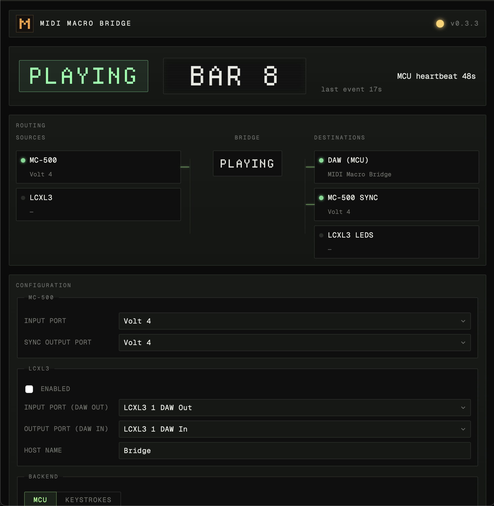

# Control Your DAW with this Rock-Solid Roland Sequencer

  <iframe
    src="https://www.youtube.com/embed/IIhBlliWr9k"
    title="Roland MC-500mkII driving LUNA"
    allow="accelerometer; autoplay; clipboard-write; encrypted-media; gyroscope; picture-in-picture; web-share"
    allowfullscreen
    style="width: 100%; height: 100%; border: 0;"
  ></iframe>

Making music with your hands is *way* more fun than using a trackpad. Hardware that sits on the desk, lit up, ready, the way an instrument is ready. That hands-on joy is what motivates the "DAWless". But, let's not kid ourselves&mdash;we're not giving up on the DAW any time soon.

I've been looking for ways to have my cake and eat it, too. It's why I started the audiocontrol project: I love to use hardware, especially weird old hardware, but I want to use the best of what modern tools have to offer at the same time.

Add the Roland MC-500 to the list of hardware we can now more comfortably integrate into modern workflows.

The MC-500mkII (1988 · 8-track · multitrack MIDI sequencer) is the kind of box that makes the case for itself. More cash register than anything else&mdash;buttons under your fingertips, a data wheel, a screen the size of a postage stamp because you don't need a big screen when the controls are this clear. Eight tracks of MIDI, 99 location memories, and the kind of build quality that means it's still chugging along after nearly four decades.

I built a way to make the MC-500mkII drive a modern DAW. Hands on the box. Eyes on the room. The DAW does what the DAW does well; the box does what the box does well.

---

## DAWless workflow without giving up the DAW

The MC-500mkII becomes a control surface for your DAW. That's the whole thing. Something you already own — or can find for not much — that sits beautifully on the desk, the buttons your fingers already know, finally getting to drive the modern session.

You hit play on the box, the DAW plays. You spin the wheel, the DAW jogs. You recall a location, the DAW seeks. That's the dispatch.

---

## Hardware control surface for DAW transport, jog, and locate

Transport buttons drive the DAW transport. The data wheel becomes the jog wheel. The 99 location memories become jump-to-marker buttons.

The location memories are the part to reread. Pre-configure verse, chorus, bridge as MC-500 locations. One button on the console jumps the DAW to that bar. Or punch a bar number into the numeric keypad — the DAW teleports there. The MC-500mkII becomes a tactile arrangement-jumping interface for whatever DAW is on the other end. Years of muscle memory finally pay rent.

---

## Compatible DAWs: Logic Pro, Ableton Live, LUNA

- **Hardware.** Roland MC-500mkII (1988) — confirmed. The Roland MC-50 (1989, smaller, cheaper, same family) — likely works, but I haven't tested it. The original Roland MC-500 (1986) — *does not work*. Different operating system, different transport behavior. If you have an MC-50 and try it, let me know.
- **DAWs.** Logic Pro, Ableton Live, LUNA. If your DAW takes a hardware control surface for transport, this is one. If it doesn't, this isn't.
- **Computer.** Mac. The Linux build runs but I haven't tested it against a DAW. No Windows yet.

---

## Download Roland sequencer DAW support now

The macOS download is a disk image with an Application inside. Drag the Application into your Applications folder, open it, point your DAW at it as a control surface, and you're running.

[Download now ›](https://github.com/audiocontrol-org/audiocontrol/releases?q=midi-macro-bridge)

This dispatch is part of a series. Already working: a Novation LaunchControlXL mk3 driving LUNA's mixer — Novation doesn't ship LUNA support out of the box; we do. A separate dispatch with video on that one is in flight. After that: more vintage gear, more DAWs, more of the console mapped, as bench needs surface them.

If you've got an MC-500mkII and a DAW, try it. If it breaks on your setup, file an issue with what gear and what DAW.

*If you want the protocol details — MIDI Song Position, Mackie Control, the bridge architecture — [the source is up on github here ›](https://github.com/audiocontrol-org/audiocontrol)*
